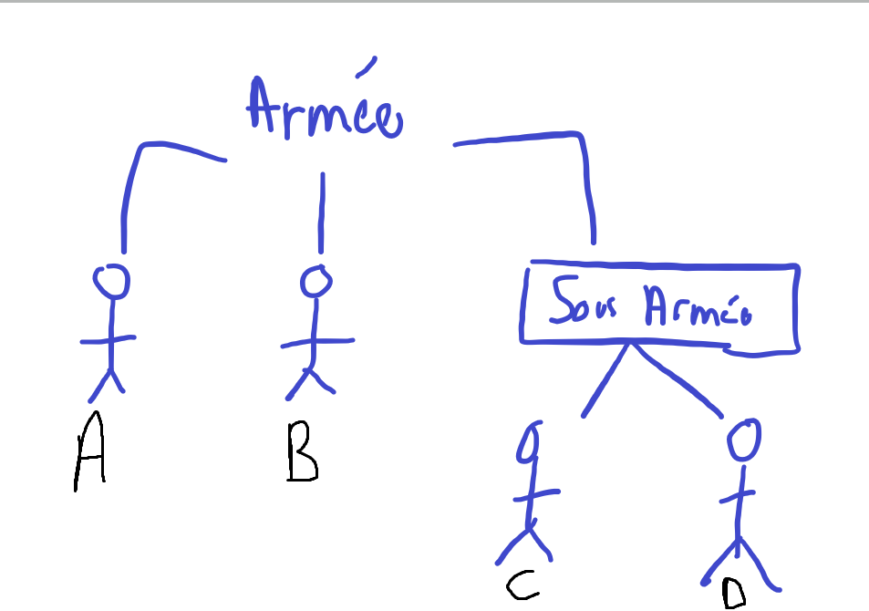

# TD Design patterns 

## Préambule
Tout d'abord il est important de preciser que mon travail à été mis en commun avec Philéas Ballon jusqu'à l'implémentation des décorateurs.
De plus, au CREMI l'extraction de l'archive a buggé j'ai donc mis en ligne sur un GitHub une version propre de mon code si l'archive bug pour vous aussi (création de classes vides) trouvable ici : https://github.com/TurboDimitri/TD_Army
## TD 5
### Décorateurs

1. Pour implementer les armes il nous suffit de créer une classe abstraite qui implémente Soldat, puiis pour chacune des armes, une classe qui hérite de cette classe abstraite et qui ainsi modifie comme on le souhaite les méthodes de Soldat
2. Les tests unitaires n'ont pas été implémenté parce que malgrè de nombreuses tentatives je n'ai pas réussi à faire marcher JUnit sur mon IDE
3. A chaque appel de force et parer on affiche dans la console le type de soldat qui appelle la méthode et l'arme avec laquelle il est équipé
4. Non ce n'est pas au Decorator de s'occuper de cette contrainte.

### Proxys
1. On crée donc l'interface SoldatWithWeapon avec les méthodes pour ajouter des armes que l'on défini dans des sous classes pour chaque type de soldats
2. Pour s'assurer qu'une arme ne puisse pas être ajoutée deux fois on donne aux classes ProxyFantassin et ProxyCavalier un booléen initialisé à faux pour chaque type d'armes qui existent, puis, dans les méthodes add[arme], si le boolén de [arme] est à faux, on ajoute l'arme puis [arme] = true, et si [arme] = true, on refuse l'ajout de l'arme au soldat.
3. Nous n'avons pas eu besoin de modifier notre implémentation pour permettre à un soldat de porter deux armes différentes.
4. Il suffit d'ajouter une variable durabilité à tout les objets de type arme, et la décrémenter quand un soldat équipé pare ou attaque. On pourrait même déclarer un deuxième constructeur qui prends en paramètre la durabilité pour que l'utilisateur puisse créer une arme avec la durabilité qu'il souhaite plutôt qu'une valeur arbitraire

## TD 6

### Composite
1. On crée donc la classe Army qui implémente l'interface SoldatWithWeapon, et qui contient un tableau de SoldatWithWeapon, ainsi une sous-armée peut-être ajoutée au tableau des troupes comme si c'était un simple soldat, conformement à la logique du desgin pattern composite.
   
   Pour ce qui est de la méthode force, il suffit d'appeler de faire des faires des appels de force sur tout les membres de l'armée, ainsi si on tombe sur une feuille, la méthode nous renverra un entier, et si on tombe sur une armée alors l'appel est récursif et on peut donc sommer la valeur des feuilles

    Pour ce qui est de la méthode parer c'est un peu plus technique, en effet si l'on voulait infliger des dégats égaux à tout les membres de l'armée il faudrait d'abord savoir combien il y à d'élements dans l'armée défenseuse (et donc dans les sous armées), on pourrait alors diviser la force par le nombre concret de soldats dans l'armée. Mais cette idée me parait contre-productive avec le principe du Composite, en effet, tout parcourir pour changer les points de vie de chaque éléments un à un n'utilise pas vraiment l'aspect recursif que nous permet ce design pattern.

    J'ai donc choisi, pour rester dans la logique du design pattern, de faire en sorte qu'une sous armée soit considérée comme un soldat à part entière, ainsi, si mon armée est consituée de la sorte : 
    
    Et que nous lui infligions 6 points de dégats, alors, A et B en prendrait 2, tandis que C et D n'en prendrait qu'1 car la sous armée en subit 2 qu'elle répartit ensuite récursivement à ses fils.
    
    En pratique on remarque que cette implémentation fait fonctionner les sous-armées comme des lignes reculées du champ de bataille car au plus une armée est loin dans l'arbre au plus les dégats qu'elle subit sont dilués.

2. Encore une fois les tests unitaires n'ont pas été implémenté car JUnit à eu raison de ma patience.

### Visitor
1. On crée donc une interface Visitor avec une méthode de visite pour chaque type de soldat que l'on a, en sachant que une armée est considérée comme un type de soldat. Puis dans les classes de ces différents soldats, une méthode accept qui appelle là méthode du visiteur avec les bons paramètres (D'ailleurs grace à la surcharge mettre des noms différents pour toutes les méthodes du Visitor n'est pas nécessaire).
2. Ici un choix d'implémentation à été fait, en effet, toutes les méthodes de mon interface Visitor renvoient void, ce qui est pratique pour le visiteur qui affiche les différents soldats d'une armée, mais un peu moins pour le vistiteur qui compte les différents types de soldat dans une armée.
    
    J'ai donc contemplé l'idée de faire une deuxième interface qui elle aurait des méthode qui renvoie deux entiers, ainsi visitorCount.accept(fantassin) renverrai [0.1] par exemple et l'appel mère ferai la somme de tout les tuples de ses fils, mais ça semblait assez compliqué et un peu contre l'idée d'une interface puisque mes deux visiteurs n'auraient plus rien en commun...

    Du coup j'ai choisi de garder une seule interface et d'ajouter deux compteurs dans ma classe VisitorCount pour compter les différents types de soldats dans une armée. Cependant j'ai donc du créer deux nouvelles méthodes dans l'interface Visitor qui ne servent que pour VisitorCount.

    À savoir :
   
    - report() : qui permet d'afficher les compteurs, et qui donc ne sert à rien pour VisitorPrint
    - reset() : afin de remettre les compteurs à 0 une fois que l'on a fini de parcourir l'armée si l'on veux en parcourir une autre, et qui encore une fois ne sert à rien pour VisitorPrint

    Je ne sais toujours pas quel était le meilleur choix d'implémentation car les deux semblent générer du code qui "sert à rien" mais comme la refléxion était intéressante il me paraissait important d'en parler.